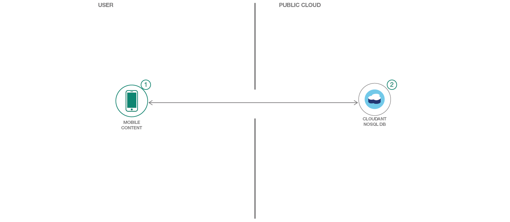
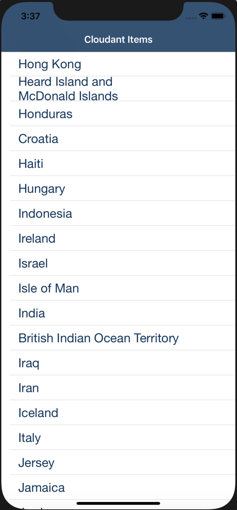

[](https://bluemix.net)
[](https://developer.apple.com/swift/)

# Create an infinite scrolling iOS application in Swift, backed by a NoSQL database

In this code pattern, you will create an infinite scrolling iOS application, similar to the user experience you'd find in popular apps like Twitter or Instagram. Instead of building a paginated list of data, data will be continuously pulled from a Cloudant NoSQL database.

When you have completed this code pattern, you will understand how to:

* Provision and integrate a Cloudant NoSQL database
* Enable infinite scrolling in the application
* Connect to additional IBM Cloud services



## Steps

> As an alternative to the steps below, you can [create this project as a starter kit on IBM Cloud](https://cloud.ibm.com/developer/appledevelopment/create-project?starterKit=dc43fe0b-f441-3bcb-9c75-2764ece288ce&defaultLanguage=IOS_SWIFT&env_id=ibm%3Ayp%3Aus-south&tenantNavMode=false&defaultDeploymentToolchain=), which automatically provisions required services, and injects service credentials into a custom fork of this pattern. Then, you can skip directly to step 4 below.

1. [Install developer tools](#1-install-developer-tools)
2. [Install dependencies](#2-install-dependencies)
3. [Create a Cloudant service instance](#3-create-a-cloudant-service-instance)
4. [Load sample data](#4-load-sample-data)
5. [Run in Xcode](#5-run-in-xcode)

### 1. Install developer tools

Ensure you have the [required developer tools installed from Apple](https://developer.apple.com/download/):

* iOS 9.0+
* Xcode 9.0
* Swift 4.0

### 2. Install dependencies

This pattern uses the IBM Cloud Mobile services and Cloudant SDKs in order to use the functionality of the Mobile Analytics, Push Notifications, and Cloudant services.

The IBM Cloud Mobile services SDK uses [CocoaPods](https://cocoapods.org/) to manage and configure dependencies.

You can install CocoaPods using the following command:

```bash
sudo gem install cocoapods
```

If the CocoaPods repository is not configured, run the following command (this may take a long time depending on your network connection and installation state):

```bash
pod setup
```

A pre-configured `Podfile` has been included in this repository. To download and install the required dependencies, run the following command from your project directory:

```bash
pod install
```

If you run into any issues during the pod install, it is recommended to run a pod update by using the following commands:

```bash
pod update
```

```bash
pod install
```

Finally, open the Xcode workspace: `{APP_Name}.xcworkspace`.

### 3. Create a Cloudant service instance

Use the [IBM Cloud Catalog](https://cloud.ibm.com/catalog/) to [create a Cloudant service instance](https://cloud.ibm.com/catalog/services/cloudant) on the Lite plan. Make sure to select **Use both legacy credentials and IAM** to receive the proper credential set for the Cloudant SDK.

When the service has been created, navigate to the **Service credentials** tab, and create a **New credential ⊕** with the default options. Click **View credentials**. Edit `iosinfinitescrollingcloudant/BMSCredentials.plist` in your Xcode project to configure your application with your Cloudant credentials.

### 4. Load sample data

To help demonstrate the infinite scrolling capability, we need to load a dataset large enough to require scrolling into our NoSQL database. This repository contains a file called `countries.json` which contains 245 documents, each with the names of a country. From the root of the repository, run:

```bash
sh setup_cloudant.sh
```

This script will use your credentials from `iosinfinitescrollingcloudant/BMSCredentials.plist` to load the data.

### 5. Run in Xcode

In Xcode, click **Product** > **Run** to start the iOS application. The app will default to displaying the first database and field it finds.



## License

This code pattern is licensed under the Apache License, Version 2. Separate third-party code objects invoked within this code pattern are licensed by their respective providers pursuant to their own separate licenses. Contributions are subject to the [Developer Certificate of Origin, Version 1.1](https://developercertificate.org/) and the [Apache License, Version 2](https://www.apache.org/licenses/LICENSE-2.0.txt).

[Apache License FAQ](https://www.apache.org/foundation/license-faq.html#WhatDoesItMEAN)
