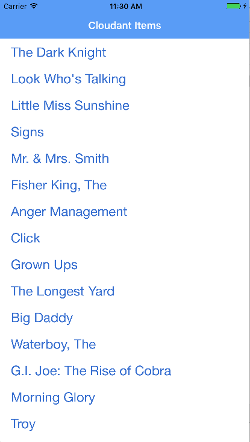

## Cloudant Infinite Scroll
IBM Cloud Mobile Starter for Cloudant Infinite Scroll in Swift

[](https://bluemix.net)

### Table of Contents
* [Summary](#summary)
* [Requirements](#requirements)
* [Configuration](#configuration)
* [Importing a Database](#importing-a-database-optional)
* [Run](#run)
* [License](#license)

### Summary

The IBM Cloud Mobile Starter for Cloudant Infinite Scroll showcases how to display data using an infinitely scrolling list.

### Requirements

* iOS 9.0+
* Xcode 9.0
* Swift 4.0

### Configuration
* [IBM Cloud Mobile services and Cloudant Dependency Mangagement](#bluemix-mobile-services-and-Cloudant-dependency-management)
* [Cloudant Credential Management](#Cloudant-credential-management)

#### IBM Cloud Mobile services and Cloudant Dependency Management
This starter uses the IBM Cloud Mobile services and Cloudant SDKs in order to use the functionality of the Mobile Analytics, Push Notifications, and Cloudant services.

The IBM Cloud Mobile services SDK uses [CocoaPods](https://cocoapods.org/) to manage and configure dependencies.

You can install CocoaPods using the following command:

```bash
$ sudo gem install cocoapods
```

If the CocoaPods repository is not configured, run the following command:

```bash
$ pod setup
```

For this starter, a pre-configured `Podfile` has been included. To download and install the required dependencies, run the following command from your project directory:

```bash
$ pod install
```

If you run into any issues during the pod install, it is recommended to run a pod update by using the following commands:

```bash
$ pod update
$ pod install
```


* Open the Xcode workspace: `{APP_Name}.xcworkspace`.
* No additional configuration is required for the iOS app. Your unique Cloudant credentials have been injected in during generation. The application will default to the first database and field it finds, so be sure to import valid data.

### Importing a Database (Optional)

If you would like to import a sample database to help demonstrate the infinite scroll capability, navigate to project root and run the `testcloudant.sh` script.

```
sh setup_cloudant.sh
```

### Run

Click **Product > Run** to start the app in Xcode.



### License
This package contains code licensed under the Apache License, Version 2.0 (the "License"). You may obtain a copy of the License at http://www.apache.org/licenses/LICENSE-2.0 and may also view the License in the LICENSE file within this package.
